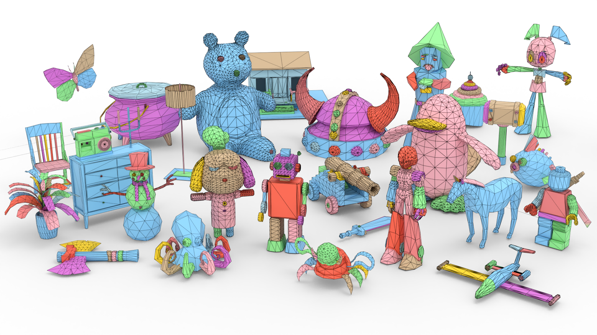

# Mesh Silksong: Auto-Regressive Mesh Generation as Weaving Silk




## todo
- [ ] Fix bugs of geometry processing like "mobius loop".
- [ ] Release checkpoint trained on more data.

## 1. Environment
#### Conda
```
conda create -n silk python=3.9
conda activate silk
pip install -r requirements.txt
```
#### Docker (Optional)
1. pull docker image
```
docker pull song21/silk:v1
```
2. start docker container

For example, if you are running docker on Windows, and this project is stored in `D:\Docker_projs\codes\MeshSilksong`, run the command in windows cmd like this:
```
docker run -it --name silk --gpus all -p 8050:22 -v D:\Docker_projs\codes\MeshSilksong:/workspace/MeshSilksong:rw song21/silk:v1
```
3. get into docker container

For example, in windows cmd:
```
docker exec -it silk /bin/bash
```
4. activate conda env (in docker container)
```
conda activate silk
```
5. If sudo in container:
```
su root
passwd: 111111
```

## 2. Checkpoints Download

#### Main checkpoint

Currently we released lite version checkpoints trained on 100K public available datasets, refer to training part for reproduction. Checkpoints trained on more datasets will be released soon.

To download the model, use huggingface-cli:

```
python3 -m pip install "huggingface_hub[cli]"
mkdir ./checkpoints
huggingface-cli download gcsong/mesh_silksong --local-dir ./checkpoints
```
Or directly download from [Huggingface](https://huggingface.co/gcsong/mesh_silksong/tree/main), and put checkpoint in this path
```
./checkpoints/release-100K/model.safetensors
```

#### Michelangelo checkpoint

If you want to train the GPT model from scratch, the pretrained [Michelangelo](https://github.com/NeuralCarver/Michelangelo) point-encoder is required for finetune. Just download `shapevae-256.ckpt` from [here](https://huggingface.co/Maikou/Michelangelo/tree/main/checkpoints/aligned_shape_latents) and put it in this path
```
miche/shapevae-256.ckpt
```

## 3. Inference
Run `sh scripts/infer_silksong_obj.sh` for inference, key parameter illustration:
- `INFER_BATCH`: the batch size for inference, you may set it to 1 on limited GPU Memory.
- `WORKSPACE`: the save dir of generated meshes.
- `TEST_INPUT`: the input dir of dense meshes/ground truth meshes. Point cloud will be sampled as GPT condition. We provide some mesh examples sampled from public datasets [here](https://drive.google.com/drive/folders/1zR7UpC1LJPN2mQC_CfR-Dn2lHRWXG5Eb?usp=sharing). Download them and put them in this path
```
datasets/sample_test/meshes/test_mix_origin/batch00/
```
- `RESUME`: main checkpoint path.

If you have a cluster, run the slurm script:
```
sbatch slurm_jobs/infer_silksong_obj.sh
```

## 4. Training
#### 4.1 Train from scratch
1. Hardware Requirements

It is recommended to prepare at least 16 GPUs if the dataset scale is 50K+. Empirically, it may take about 2 weeks for 100K data items on 16 H800 GPUs, the training time will be significantly shorter with more GPUs.

2. Point Cloud Encoder

Download pretrained [Michelangelo](https://github.com/NeuralCarver/Michelangelo) point-encoder.

3. Data Prefilter

To prevent the blocking of data iter during training, the training data is recommended to be processed via silksong tokenization first to filter unnessary items (e.g. Meshes with too many faces).

Refer to [dataset_clean.md](https://github.com/gaochao-s/Mesh-Silksong/blob/main/dataset_clean.md) for data prefilter and data organization.


4. Data Organization

Following [dataset_clean.md](https://github.com/gaochao-s/Mesh-Silksong/blob/main/dataset_clean.md), the training data should be organized in a `.xlsx` file for each dataset and the file should be saved to `./datasets/cleaned`. The testing data's `.xlsx` file should be saved in `datasets/sample_test/tables`. During training, 32 items will be selected from training set for evaluation. Refer to `config/options.py DataConfigs` for modifying. 


5. Training

Refer to the template `scripts/train_silksong_scratch_gpu16.sh` for training from scratch. Follow the guidance to handle different requirements:

- If you just want to train on a single node with 8 GPUs: 

Just modify `--config_file acc_configs/gpu16.yaml` to `--config_file acc_configs/gpu8.yaml`

- If you want to train on 2 nodes with 8 GPUs for each node:

Apply nodes first, supposing the `server10` and `server11` are available nodes on cluster and the internal network connection should be available. Then, connect to main node `server10`:
```
ssh server10
sh MeshSilksong/scripts/train_silksong_scratch_gpu16.sh
```
Then, connect to another node `server11`:
```
ssh server11
MACHINE_RANK=1 MASTER_ADDR=server10 MeshSilksong/scripts/train_silksong_scratch_gpu16.sh
```
After doing these, the multi-nodes training should get started.

6. Specify Training Dataset

Following [dataset_clean.md](https://github.com/gaochao-s/Mesh-Silksong/blob/main/dataset_clean.md), each dataset that used for training will be stored in a `.xlsx` file. You can specify the dataset in `DATA_SUBSETS` of training script.


#### 4.2 Finetune on your own datasets
Refer to the template `scripts/train_silksong_ft_gpu16.sh` for finetuning on you own dataset. You may follow the templete in [dataset_clean.md](https://github.com/gaochao-s/Mesh-Silksong/blob/main/dataset_clean.md) to organize them in a .xlsx file.


## 5. Non-manifold Process

We also encapsulated the code for non-manifold processing separately. Refer to [nonmani_process.md](https://github.com/gaochao-s/Mesh-Silksong/blob/main/nonmani_process.md) for guidance.

## Acknowledgements
The half-edge data structure of geometry processing is borrowed from [EdgeRunner](https://github.com/NVlabs/EdgeRunner)'s C++ implementation.
```
@article{tang2024edgerunner,
  title={Edgerunner: Auto-regressive auto-encoder for artistic mesh generation},
  author={Tang, Jiaxiang and Li, Zhaoshuo and Hao, Zekun and Liu, Xian and Zeng, Gang and Liu, Ming-Yu and Zhang, Qinsheng},
  journal={arXiv preprint arXiv:2409.18114},
  year={2024}
}
```
The model architecture is borrowed from [BPT](https://github.com/Tencent-Hunyuan/bpt)'s open source implementation.
```
@inproceedings{weng2025scaling,
  title={Scaling mesh generation via compressive tokenization},
  author={Weng, Haohan and Zhao, Zibo and Lei, Biwen and Yang, Xianghui and Liu, Jian and Lai, Zeqiang and Chen, Zhuo and Liu, Yuhong and Jiang, Jie and Guo, Chunchao and others},
  booktitle={Proceedings of the Computer Vision and Pattern Recognition Conference},
  pages={11093--11103},
  year={2025}
}
```
Thanks other wonderful works:
- [Michelangelo](https://github.com/NeuralCarver/Michelangelo)
- [TreeMeshGPT](https://github.com/sail-sg/TreeMeshGPT)
- [DeepMesh](https://github.com/zhaorw02/DeepMesh)
- [MeshAnything V2](https://github.com/buaacyw/MeshAnythingV2/tree/main)


## Citation
